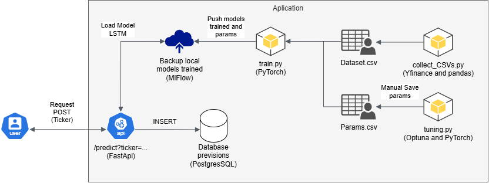

# 📘 FIAP Tech Challenge Deep Learning Finance Actions - Fase 4

Projeto de deep learning focado na construção e treinamento de modelos LSTM para ações do setor de energia, visando a previsão do valor de fechamento da ação para o próximo dia.

---

## 📌 Sobre o Projeto

Este repositório corresponde à entrega final da quarta fase do curso de pós-graduação em Engenharia de Machine Learning. Ele tem como objetivo apresentar um modelo de deep learning treinado e colocado em produção, aplicando todos os conceitos e habilidades desenvolvidas durante esta fase.

- **Integração MLflow e PyTorch**: Durante o processo de construção, foi aplicada a integração entre **MLflow** e **PyTorch**. O PyTorch foi utilizado para a construção e treinamento dos modelos, enquanto o MLflow gerenciou o salvamento e o rastreamento de métricas de erro (MSE, RMSE e MAE).
- **Optuna**: Utilizado para a descoberta e coleta dos melhores hiperparâmetros para cada modelo, baseado em sua própria base de dados.
- **API Rest com FastAPI**: Construção de uma API para servir os modelos e realizar previsões para o dia seguinte (D+1). A API entrega os resultados e os salva no banco de dados para rastreamento e análises futuras de desempenho.

## ⚙️ Tecnologias Utilizadas

| Tecnologia | Função |
| :--- | :--- |
| **FastAPI** | Framework de alta performance para construção de APIs. |
| **PostgreSQL** | Banco de dados relacional robusto para armazenamento de previsões. |
| **Scikit-Learn** | Biblioteca para pré-processamento e ferramentas de machine learning. |
| **Poetry** | Gerenciamento de dependências e ambientes virtuais. |
| **Optuna** | Framework de otimização automática de hiperparâmetros (Tuning). |
| **Matplotlib** | Criação de visualizações estáticas, animadas e interativas. |
| **Seaborn** | Geração de gráficos estatísticos baseados no Matplotlib. |
| **Jupyter** | Ambiente interativo para execução de código e análise exploratória. |
| **PyTorch** | Biblioteca principal para construção dos modelos de Deep Learning (LSTM). |
| **MLflow** | Plataforma para gerenciar o ciclo de vida dos modelos (rastreamento e registro). |
| **YFinance** | Biblioteca para coleta de dados históricos das ações financeiras. |

---

## 📐 Arquitetura



---

## 🚀 Como Executar Localmente

### 📦 Requisitos

* [Python 3.13+](https://www.python.org/downloads/)
* [Poetry](https://python-poetry.org/docs/)

### 📂 Instalação via Poetry, inicialização da API e MLflow

1. Clone o projeto, instale as dependências com o Poetry e inicialize o servidor FastAPI:
```bash
git clone https://github.com/KevinOFL/FIAP-Tech-Challenge-Deep-Learning-Finance-Actions.git
cd FIAP-Tech-Challenge-Machine-Learning-Property
poetry install
uvicorn src.api_deep_finances.api.main:app --reload
```
* Crie um novo prompt e inicialize o servidor do MlFlow
```
mlflow ui
```
---
## 📌 Boas Práticas Aplicadas

- **Pré-processamento robusto**: Tratamento de dados e engenharia de features.

- **Análise Exploratória (EDA)**: Estudo detalhado das séries temporais.

- **Tratamento de Outliers**: Aplicação de técnicas de capping para reduzir ruídos.

- **Modularização**: Funções de pré-processamento reutilizáveis.

- **Escalonamento**: Uso de MinMaxScaler (dois scalers distintos: um para a feature alvo e outro para o conjunto de dados completo).

- **Treinamento Flexível**: Duas funções de treinamento (uma para execução em lote/massa e outra específica para um único modelo).

- **API Rest**: Endpoint dedicado para inferência, recebendo o ticker da ação desejada.

- **Segurança**: Uso de variáveis de ambiente (.env) para segredos e configurações.

- **MLflow**: Versionamento de modelos, rastreio de experimentos e artefatos.

- **Validação Cruzada**: Função própria de train and test split, garantindo tensores formatados corretamente para LSTMs.

- **Tuning Automatizado**: Uso de Optuna para otimização de hiperparâmetros.

- **Rastreabilidade**: Banco de dados dedicado para registrar o histórico de previsões e versões dos modelos.

- **Coleta de Dados**: Uso do YFinance para ingestão de dados confiáveis, evitando instabilidades de web scraping direto.
---

## 👥 Contribuição

Pull requests são bem-vindos! Abra uma issue ou contribua diretamente via fork + PR.

---

## 📃 Licença

Este projeto está licenciado sob os termos da licença [MIT](LICENSE).

